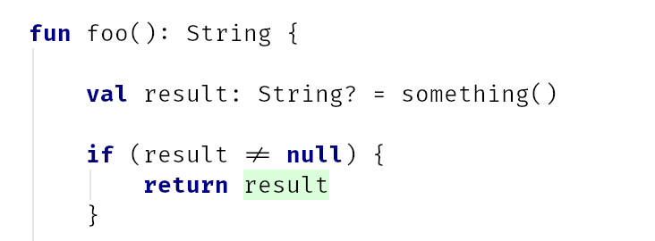

## Composable Error Handling

### Stojan Anastasov

@s_anastasov

>--

## Functional Error Handling

### Stojan Anastasov

@s_anastasov

Note: Alternative title. Composition is the benefit, functional programming is how we get there

---

## Solving problems

As developers we solve complex problems.

>--

## Android Activity Lifecycle


>--

## Solving complex problems

- Split problem into smaller problems <!-- .element: class="fragment" data-fragment-index="1" -->
- Write code solving the small problems <!-- .element: class="fragment" data-fragment-index="2" -->
- Combine the solutions of the small problems <!-- .element: class="fragment" data-fragment-index="3" -->

Note: It it very important to write as little glue code as possible when combining the solutions of the small problems

---

## Data Validation

The problem of user sign up with data:

- Email
- First Name
- Last Name
- Date of Birth

Note: We need to validate: the form on Web/Mobile, on BE we validate the data coming from the client

>--

## Validation rules

- Email must contain @
- First Name and Last Name can't be blank. Max length 50 (DB limit).
- Date of Birth must be formatted as YYYY-MM-DD

Note: The best way to validate email is by sending a confirmation link to the user

>--

## The DTO

```kotlin

data class UserDto(
    val email: String?,
    val firstName: String?,
    val lastName: String?,
    val dateOfBirth: String?
)
```

*Postel's law*: Be conservative in what you do, be liberal in what you accept from others.
<!-- .element: class="fragment" data-fragment-index="1" -->

Note: Everything is nullable. On FE the fields can be empty. On BE the client might receive an invalid JSON.

>--

## The Domain

```kotlin

data class Email(val email: String) { companion object }
```
<!-- .element: class="fragment" data-fragment-index="1" -->

```kotlin

data class String50(val value: String) { companion object }
```
<!-- .element: class="fragment" data-fragment-index="2" -->

```kotlin

import java.time.LocalDate

data class User(
    val email: Email,
    val firstName: String50,
    val lastName: String50,
    val dateOfBirth: LocalDate
) { companion object }
```
<!-- .element: class="fragment" data-fragment-index="3" -->

Note: We can easily combine 4 fields into a data class. We validate the data once, at the edge of the system, and in the domain layer we can assume we have valid data.

---

## Validating email

Email must contain @

```kotlin

fun validateEmail(email: String?): Boolean =
    email != null && email.contains('@')
```

Note: Sub-problem #1

>--

## Validating First/Last Name

First Name and Last Name can't be blank. Max length 50 (DB limit).

```kotlin

fun validateName(name: String?): Boolean =
    !name.isNullOrBlank() && name.length < 50
```

Note: Sub-problem #2

>--

## Validating DOB

Date of Birth must be formatted as YYYY-MM-DD

```kotlin

import java.time.LocalDate
import java.time.format.DateTimeParseException

fun validateDateOfBirth(dob: String?): Boolean =
    try {
        LocalDate.parse(dob)
        true
    } catch (e: DateTimeParseException) {
        false
    }
```

Note: Sub-problem #3

>--

## Validating User

```kotlin

import java.time.LocalDate
import java.time.format.DateTimeParseException

fun validateUser(
    email: String?,
    firstName: String?,
    lastName: String?,
    dob: String?
): Boolean = validateEmail(email)
        && validateName(firstName)
        && validateName(lastName)
        && validateDateOfBirth(dob)
```

Note: Combining the solutions of the sub-problems. We use an operator provided by the language to combine the results of the smaller functions

>--

## Usage (A) -> Boolean

```kotlin

validateUser("stojan", null, "", "August")
// false
```


<!-- .element: class="fragment" data-fragment-index="1" -->

Note: Because we get a Boolean, the only thing we can say to the user is NO. Ideally we want to hep the user fix the problem.

>--

## Booleans

- Composes well

- Bad error messages

Boolean -> True | False

Note: Because we only get a Boolean, we don't have any info about the problem. We could call the validation functions again, to see what the problem is, but that makes the code more complex.

---

## Exceptions

```kotlin

fun validateEmailBool(email: String?): Boolean {
    require(email != null && email.contains('@'))
    { "Email must contain @, found: '$email'" }
    return true
}
```
<!-- .element: class="fragment" data-fragment-index="1" -->

IllegalArgumentException if the predicate is false
<!-- .element: class="fragment" data-fragment-index="1" -->

Note: Exceptions have a message that we can use to display what the problem was.

>--

## Return value is always true

```kotlin

fun validateEmailUnit(email: String?): Unit =
    require(email != null && email.contains('@'))
    { "Email must contain @, found: '$email'" }

fun validateNameUnit(name: String?): Unit =
    require(!name.isNullOrBlank() && name.length < 50)
    { "Name must be between 1 and 50 chars, found: '$name'" }

fun validateDateOfBirthUnit(dob: String?): Unit {
    LocalDate.parse(dob)
}
```

Note: Since the value is always true, we can return Unit instead

>--

## Composing

```kotlin

fun validateUserUnit(
    email: String?,
    firstName: String?,
    lastName: String?,
    dob: String?
): Unit {
    validateEmailUnit(email)
    validateNameUnit(firstName)
    validateNameUnit(lastName)
    validateDateOfBirthUnit(dob)
}
```

Note: We can try to compose it by calling all four functions one by one

>--

## Usage (A) -> Unit + Exception

```kotlin

validateUserUnit("stolea@gmail.com", "Stojan", "An", "1995-10-10")
```

```kotlin

val result = try {
    validateUserUnit("stojan", null, "", "August")
    "Valid"
} catch (e: Exception) {
    e.message!!
}
result
// Email must contain @, found: 'stojan'
```
<!-- .element: class="fragment" data-fragment-index="1" -->

We only get the first error! <!-- .element: class="fragment" data-fragment-index="1" -->

Note: It works well in the happy path, but if there is an error we only get the first one. Best UX is if we get all errors.

>--

## Accumulate errors

```kotlin

fun validateUserAccumulateErrors(
    email: String?,
    firstName: String?,
    lastName: String?,
    dob: String?
): Unit {
    val errors = mutableListOf<String>()

    try {
        validateEmailUnit(email)
    } catch (e: IllegalArgumentException) {
        errors.add(e.message!!)
    }

    // TODO: firstName, lastName, dob

    if (errors.isNotEmpty()) {
        throw IllegalArgumentException("Validation errors: ${errors.joinToString()}")
    }
}
```

Glue code to the MAX!

Note: This doesn't scale very well, it's a lot of repeatable code and it's error prone.

>--

## Problems with Exceptions

- Boilerplate code
- Throwing Exceptions is expensive on JVM
- Dos not fit on a slide

Note: we can fix some of those problems

---

## Errors as values

```kotlin

typealias ErrorMsg = String
```

```kotlin

fun validateEmail(email: String?): ErrorMsg? =
    if (email != null && email.contains('@')) null
    else "Email must contain @, found: '$email'"
```
<!-- .element: class="fragment" data-fragment-index="1" -->

```kotlin

fun validateName(name: String?): ErrorMsg? =
    if (!name.isNullOrBlank() && name.length < 50) null
    else "Name must be between 1 and 50 chars, found: '$name'"

fun validateDateOfBirth(dob: String?): ErrorMsg? = TODO()
```
<!-- .element: class="fragment" data-fragment-index="2" -->

Note: ErrorMsg is just a convenient typealias for readability. When ErrorMsg is null, the data is valid. Otherwise we return the error message.

>--

## Composing values

```kotlin

fun validateUser(
    email: String?,
    firstName: String?,
    lastName: String?,
    dob: String?
): ErrorMsg? {
    val errorMsg = listOfNotNull(
        validateEmail(email),
        validateName(firstName),
        validateName(lastName),
        validateDateOfBirth(dob)
    ).joinToString()
    return if (errorMsg.isEmpty()) null else errorMsg
}
```

Note: listOfNotNull will filter out the null values (the valid data) keeping only the errors. The code for composing the sub-problems is not too bad.

>--

## ErrorMsg

- Composable
- Good error messages

- Developer friendly ?

Note: This composes well (little glue code), has proper error messages. Is it developer friendly? Let's see the usage.

>--

## Error prone

```kotlin

    val email: String? = "stolea@gmail.com"
    val emailErr: ErrorMsg? = validateEmail(email)
    if (emailErr == null) {
        Email(email!!) // <-- Error prone
    }
```

validateEmail already does a null check

Note: We don't want to duplicate the null check that validateEmail already does. It kind of feels like writing Java.

>--

## Smart cast



Note: In Kotlin, when we do a type check, the compiler does the casting for us. Unlike Java where we have to do it manually (error prone)

>--

## Can we do better


Note: Can we have our cake and eat it too. Let's try a different approach.

---

## ValRes

```kotlin

sealed class ValRes<out E, out A> {
    data class Valid<A>(val a: A) : ValRes<Nothing, A>()
    data class Invalid<E>(val e: E) : ValRes<E, Nothing>()
}
```

```kotlin

fun <A> valid(a: A): ValRes<Nothing, A> = ValRes.Valid(a)

fun <E> invalid(e: E): ValRes<E, Nothing> = ValRes.Invalid(e)
```
<!-- .element: class="fragment" data-fragment-index="1" -->

Note: Always return a value. With ValRes we return the error in case of failure and the converted valid value in case of success.

>--

## ValRes in the small

```kotlin

fun validateEmail(email: String?): ValRes<String, Email> =
    if (email != null && email.contains('@')) valid(Email(email))
    else invalid("Email must contain @, found: '$email'")
```

```kotlin

fun validateName(name: String?): ValRes<String, String50> =
    if (!name.isNullOrBlank() && name.length < 50) valid(String50(name))
    else invalid("Name must be between 1 and 50 chars, found: '$name'")
```
<!-- .element: class="fragment" data-fragment-index="1" -->

```kotlin

fun validateDateOfBirth(dob: String?): ValRes<String, LocalDate> = TODO()
```
<!-- .element: class="fragment" data-fragment-index="2" -->

Note: The validation function for a single value looks similar

>--

## Combining ValRes

```kotlin

typealias Valid<A> = ValRes.Valid<A>
typealias Invalid<E> = ValRes.Invalid<E>

fun <E, A, B> tupled(
            combine: (E, E) -> E,
            a: ValRes<E, A>,
            b: ValRes<E, B>
        ): ValRes<E, Pair<A, B>> =
            if (a is Valid && b is Valid) valid(Pair(a.a, b.a))
            else if (a is Invalid && b is Invalid) invalid(combine(a.e, b.e))
            else if (a is Invalid) invalid(a.e)
            else if (b is Invalid) invalid(b.e)
            else throw IllegalStateException("This is impossible")
```

Note: Composing two ValRes values. We need the two values and a function that composes the errors. In case of success we return a pair. If there are two errors we combine them. If there is one error we return that error

>--

## Usage

```kotlin

validateEmail("stolea@gmail.com")
// Valid(a=Email(email=stolea@gmail.com))
```

```kotlin

validateEmail("email")
// Invalid(e=Email must contain @, found: 'email')
```
<!-- .element: class="fragment" data-fragment-index="1" -->

```kotlin

tupled(
    {e1, e2 -> "$e1, $e2"},
    validateEmail("stojan"),    //invalid
    validateName(null)          //invalid
)
// Invalid(e=Email must contain @, found: 'stojan', Name must be between 1 and 50 chars, found: 'null')
```
<!-- .element: class="fragment" data-fragment-index="2" -->

Note: Usage for valid, invalid and multiple failures

>--

```kotlin

data class Triple<A, B, C>(val a: A, val b: B, val c: C)

fun <E, A, B, C> tupled(
            combine: (E, E) -> E,
            a: ValRes<E, A>,
            b: ValRes<E, B>,
            c: ValRes<E, C>
        ): ValRes<E, Triple<A, B, C>> = TODO()
```

Note: If we want to combine three values, we can do it with this function. The bad news is we have to write this for different number of values. The good news it's generic and works for any type. Meaning we can write it as a library.

---

## Arrow-kt


Functional companion to Kotlin's Standard Library

arrow-kt.io

Note: That library already exists, it's called Arrow.

>--

## Validated

```kotlin
sealed class Validated<out E, out A> {
    data class Valid<out A>(val a: A) : Validated<Nothing, A>()
    data class Invalid<out E>(val e: E) : Validated<E, Nothing>()
}
```

```kotlin

import arrow.core.*

typealias ValidatedNel<E, A> = Validated<Nel<E>, A>
```
<!-- .element: class="fragment" data-fragment-index="1" -->

Note: Arrow comes with a validation datatype called Validated<E, A>. Usually errors are collected in a List. Nel is short for NonEmptyList. You can get a valid value or a list with a minimum of one error.

>--

## ValidationResult

```kotlin

typealias ValidationResult<A> = ValidatedNel<String, A>
```

```kotlin

fun Email.Companion.create(email: String?): ValidationResult<Email> =
    if (email != null && email.contains('@')) Email(email).valid()
    else "Email must contain @, found: '$email'".invalidNel()
```
<!-- .element: class="fragment" data-fragment-index="1" -->

Note: In the examples I will just collect error messages as strings. In practice you might define a sealed class with different errors.

>--

## Validating in the small

```kotlin

fun String50.Companion.create(name: String?): ValidationResult<String50> =
    if (!name.isNullOrBlank() && name.length < 50) String50(name).valid()
    else "Name must be between 1 and 50 chars, found: '$name'".invalidNel()
```

```kotlin

fun validateDateOfBirth(dob: String?): ValidationResult<LocalDate> =
    try {
        LocalDate.parse(dob).valid()
    } catch (e: DateTimeParseException) {
        "Date of Birth must be a valid date, found: '$dob'".invalidNel()
    }
```
<!-- .element: class="fragment" data-fragment-index="1" -->

Note: The validation functions are similar to what we saw before. Arrow comes with valid and invalidNel extension functions to create Valid/Invalid type. The create functions are defined on the companion object

>--

```kotlin

import arrow.core.extensions.nonemptylist.semigroup.semigroup
import arrow.core.extensions.validated.applicative.applicative

fun validateNameAndEmail(
    email: String?,
    firstName: String?
): ValidationResult<Tuple2<Email, String50>> =
    ValidationResult.applicative(Nel.semigroup<String>())
        .tupled(
            Email.create(email),       // ValidationResult<Email>
            String50.create(firstName) // ValidationResult<String50>
        ).fix()
```

Note: Combining two values with ValidationResult. tupled combines two values that can potentially fail. Returns Invalid in case of failure or Valid if both succeed. Typle2 is just like Pair in Kotlin.

>--

## Applicative

Combine values from multiple independent computations that can potentially fail.

`tupled` 2-X arguments returns `Tuple2-TupleX`

Note: the function tupled is defined starting with 2 arguments up until X. Depending on the number of argument it will return Tuple2-X in case of success. In case of failure it return Invalid, for our example ValidationResult.Invalid

>--

## Semigroup

A semigroup for some given type A has a single operation (which we will call combine), which takes two values of type A, and returns a value of type A. This operation must be guaranteed to be associative.

```kotlin

interface Semigroup<A> {

    fun combine(a: A, b: A): A
}
```

Note: If we have two Nel, we can combine them by adding the items. This is similar to the combine function we saw for ValRes.

>--

## Validating name and email

```kotlin

validateNameAndEmail("stolea@gmail.com", "Stojan")
// Valid(a=Tuple2(a=Email(email=stolea@gmail.com), b=String50(value=Stojan)))
```

```kotlin

validateNameAndEmail("Not an email", "     ")
// Invalid(e=NonEmptyList(all=[Email must contain @, found: 'Not an email', Name must be between 1 and 50 chars, found: '     ']))
```

<!-- .element: class="fragment" data-fragment-index="1" -->

Note: Usage example with valid and invalid data. We get all error messages.

>--

```kotlin

import arrow.core.extensions.nonemptylist.semigroup.semigroup
import arrow.core.extensions.validated.applicative.applicative

fun User.Companion.create(
    email: String?,
    firstName: String?,
    lastName: String?,
    dob: String?
): ValidationResult<User> =
    ValidationResult.applicative(Nel.semigroup<String>())
        .tupled(
            Email.create(email),
            String50.create(firstName),
            String50.create(lastName),
            validateDateOfBirth(dob)
        )
        .fix()  // Tuple4<Email, String50, String50, LocalDate>
        .map { User(it.a, it.b, it.c, it.d) }
```

Note: Validating a user. We get a Tuple4 and use map to convert it to a User. Map operates on the Valid result just like Option.

>--

## Create user (valid)

```kotlin

User.create(
    email = "stolea@gmail.com",
    firstName = "Stojan",
    lastName = "Anastasov",
    dob = "1991-10-10"
)
// Valid(a=User(email=Email(email=stolea@gmail.com), firstName=String50(value=Stojan), lastName=String50(value=Anastasov), dateOfBirth=1991-10-10))
```

Note: Successful validation, we get a valid user in case of success

>--

## Create user (invalid)

```kotlin

User.create(
    email = "",
    firstName = "   ",
    lastName = "a",
    dob = "10.10.1992"
)
// Invalid(e=NonEmptyList(all=[Date of Birth must be a valid date, found: '10.10.1992', Email must contain @, found: '', Name must be between 1 and 50 chars, found: '   ']))
```

Note: Unsuccessful validation, we get all error messages

>--

## Extracting the value

```kotlin

val user = User.create(
    email = "stolea@gmail.com",
    firstName = "Stojan",
    lastName = "Anastasov",
    dob = "1991-10-10"
)

user.fold(
    { e: Nel<String> -> TODO() },
    { validUser: User -> validUser }
)
// User(email=Email(email=stolea@gmail.com), firstName=String50(value=Stojan), lastName=String50(value=Anastasov), dateOfBirth=1991-10-10)
```

Note: we can extract the value by providing two lamda functions, one for the invalid and one for the valid case.

>--

## Benefits of ValidationResult

- It composes well
- Good error messages
- Developer friendly
- Composition functions are written and tested

Note: It composes well, we need to write a few lines of code but then it doesn't grow as the number of inputs grow. We get a value (error message) in case of invalid data, and we get all errors. In case of valid data we get the data transformed into our valid domain model. applicative takes care of composition.

>--

## Learn more

arrow-kt.io

Patterns -> Error Handling

Note: An error handling tutorial that includes switching between Fail fast and accumulate error strategy by passing a parameter

---

## Composition

How do things compose

>--

## Lego block


Note: Lego blocks are a good example of composition

>--

## Lego combined


Note: We can combine two lego blocks into something bigger. Then we can further compose this new shape further in the same way

>--

## Lego Falcon


Note: we can even build something as complex as the Millennium Falcon

>--

## Combining functions

```kotlin

// (String?) -> ValidationResult<Email>
fun validateEmail(email: String?): ValidationResult<Email> = TODO()
```

```kotlin

// (String?, String?, String?, String?) -> ValidationResult<User>
fun validateUser(
    email: String?,
    firstName: String?,
    lastName: String?,
    dob: String?): ValidationResult<User> = TODO()
```
<!-- .element: class="fragment" data-fragment-index="1" -->

Note: If we have four functions that take an raw value and return a ValidationResult of some valid value. We can compose them into a function that takes four raw values and returns a ValidationResult of four valid things

---

## Summary

We can validate data using different technics

- (A) -> Boolean
- (A) -> Unit + Exceptions <!-- .element: class="fragment" data-fragment-index="1" -->
- (A) -> ErrorMsg? <!-- .element: class="fragment" data-fragment-index="2" -->
- (A) -> ValRes <!-- .element: class="fragment" data-fragment-index="3" -->
- (A) -> Validated (arrow-kt) <!-- .element: class="fragment" data-fragment-index="4" -->

Note: Booleans compose well, but have a problem with error messages. Unit + Exception doesn't compose well, we only get the first error. ErrorMsg is good in terms of composition and error messaging but can be error prone because we have to manually convert to the valid domain value. Our custom made Validation type works fine, but we need to write the functions to combine multiple Validation values ourselves. Finally we saw that arrow already has that datatype and the combinators for combining values. It has been used in production for a while and works.

---

## Thank You

### Questions
